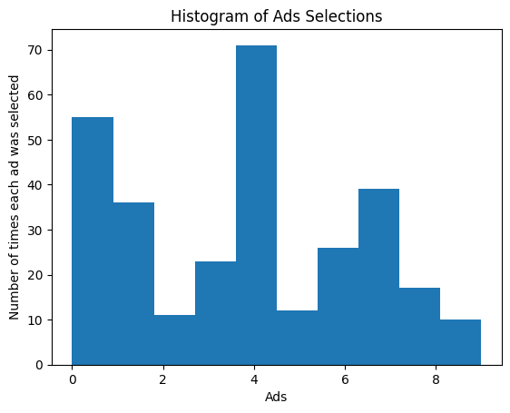
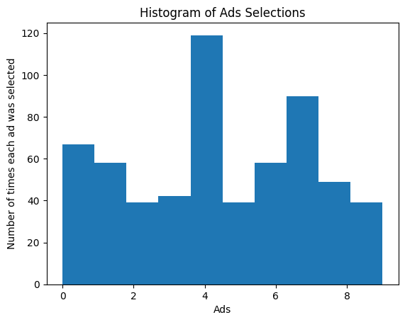
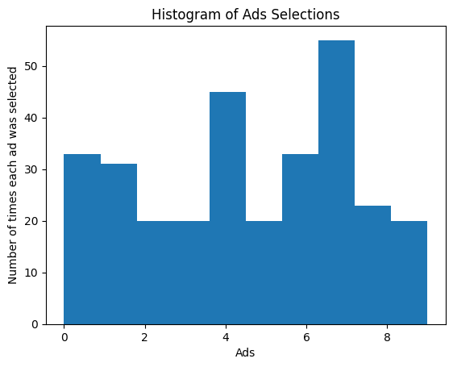

# Thompson Sampling

This project showcases the capabilities of the **Thompson Sampling** algorithm, a Bayesian approach to solving the **Multi-Armed Bandit** problem.  
Unlike the **Upper Confidence Bound (UCB)** algorithm, which is deterministic, Thompson Sampling is a **probabilistic** algorithm that balances exploration and exploitation using Bayesian inference.

## Formula


- **Beta Distribution Sampling:**

  θᵢ ~ Beta(αᵢ, βᵢ)  
  where:  
  αᵢ = number of successes + 1  
  βᵢ = number of failures + 1

- **Arm Selection:**

  aₜ = argmaxᵢ(θᵢ)

- **Posterior Update:**

  If reward = 1:  
  → αᵢ = αᵢ + 1

  If reward = 0:  
  → βᵢ = βᵢ + 1

## Algorithm

The Thompson Sampling algorithm is a Bayesian approach to solving the Multi-Armed Bandit problem. It works by maintaining a probability distribution (usually Beta for binary outcomes) over the reward probabilities of each arm and updating this distribution as more data is collected.

###  Step-by-Step Process

1. **Initialize**:
   - For each arm, track:
     - `number_of_rewards_1[i]`: number of times arm `i` returned reward = 1
     - `number_of_rewards_0[i]`: number of times arm `i` returned reward = 0

2. **For each round (from 1 to N)**:
   - For each arm `i`:
     - Sample a value `θᵢ` from the Beta distribution:
       ```
       θᵢ ~ Beta(number_of_rewards_1[i] + 1, number_of_rewards_0[i] + 1)
       ```
   - Select the arm with the highest sampled value:
     ```
     selected_arm = argmax(θ₀, θ₁, ..., θ_d)
     ```
   - Observe the reward from the selected arm:
     - If reward is 1: increment `number_of_rewards_1[selected_arm]`
     - If reward is 0: increment `number_of_rewards_0[selected_arm]`

3. **Repeat** the process for all rounds.


# Comparison between UCB and Thompson Sampling 

Notice the number of rounds both the algorithms take to identify the best ad in thompson_sampling.ipynb and ucb.ipynb . Thompson Sampling is able to identify the best ad (ad 4) in 300 rounds, lesser than UCB which identifies it in 600 rounds . 
NOTE : UCB is not able to identify ad 4 as the best ad below 500 rounds . 

<p align="center">
  
  &nbsp; &nbsp;
  
</p>

<p align="center">
  <em>Figure 1: Thompson Sampling (300 rounds) vs Upper Confidence Bound (600 rounds) </em>
</p>


# Performance Evaluation Across 300 Rounds

<p align="center">
  
  &nbsp; &nbsp;
  
</p>

<p align="center">
  <em>Figure 1: Thompson Sampling vs Upper Confidence Bound across 300 rounds</em>
</p>